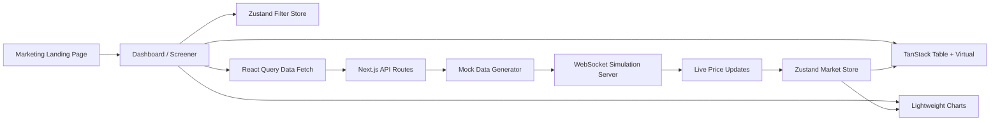

# Architecture

## Key Choices

- Server state comes from React Query.
- UI and interaction state come from Zustand.
- Large table rendering uses TanStack Virtual.
- Candlestick and indicator display use Lightweight Charts.
- The websocket layer is separated into a standalone `ws` server so it can be run independently from Next.js.

## Responsive Layout

- Mobile: stacked layout, simplified navigation, table and chart appear one after the other.
- Tablet: collapsible style layout with the sidebar above or beside the data.
- Desktop: three-column screener layout with filters, grid, and chart visible together.
